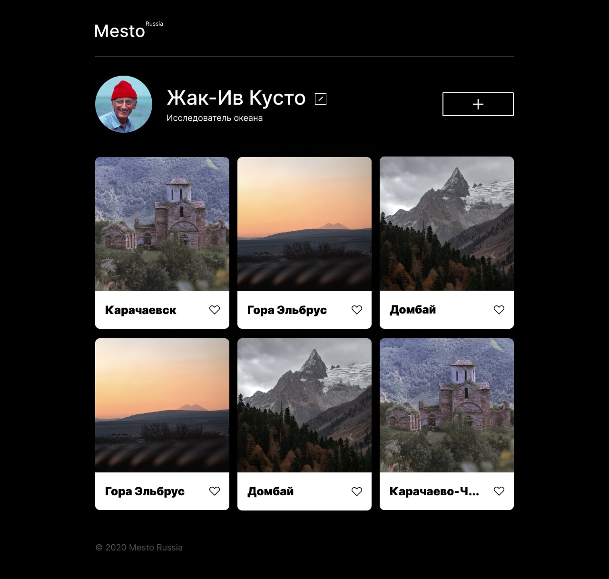

[](https://github.com/PeachMood/react-mesto-api-full-gha/actions/workflows/tests.yml)
# Mesto
Сайт для работы с карточками. Позволяет добавлять красивые фотографии и ставить лайки карточками других пользователей.
Данный репозиторий включает frontend и backend части приложения.



## Функциональность
1. 🔐 Авторизация
2. 👤 Редактирование профиля
3. ❌ Добавление/удаление карточки
4. 🤍 Постановка и снятие лайка

## Технологии
#### Frontend

#### Backend

## Начало работы
#### Требования
Для работы приложения необходимо установить:
* [Node.js](https://nodejs.org/ru/blog/release/v18.12.0) 18.12+
* [npm](https://docs.npmjs.com/downloading-and-installing-node-js-and-npm) (обычно идет с Node.js)
* [MongoDB](https://www.mongodb.com/docs/manual/installation/) 4.4+

#### Установка
1. Клонируйте репозиторий
   ```
   https://github.com/PeachMood/react-mesto-api-full-gha.git
   cd react-mesto-api-full
   ```
2. Установите backend зависимости
   ```
   cd ./backend
   npm install
   ```
3. Создайте файл .env в этой же директории проекта и пропишите в нем настройки приложения и базы данных, например:
   ```
   NODE_ENV=production
   JWT_SECRET=jwt-secret
   MONGO_HOST=localhost
   MONGO_PORT=27017
   MONGO_DB=bitfilmsdb
   ```
4. Установите frontend зависимости
   ```
   cd ./frontend
   npm install
   ```

#### Запуск
1. Запустите MongoDB
   ```
   mongod
   ```
2. Запустите сервер
   ```
   cd ./backend
   npm run start
   ```
   Теперь к нему можно обращаться по `localhost:3000`
3. Запустите клиент
   ```
   cd ./frontend
   npm run start
   ```
   Сайт будет доступен по адресу `localhost:4200`
